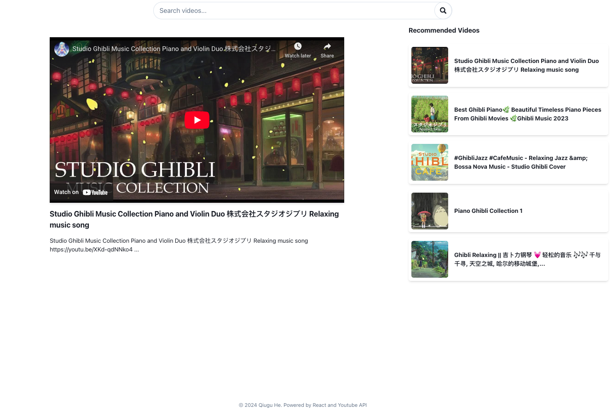

# Youtube Player

A youtube player that fetching videos from google API. Built with React useState, useEffect, custom hooks, parent & child component.

[Demo address](https://youtubeplayer-one.vercel.app/)

## Installation:
- Download the repo
- npm install
- npm start

